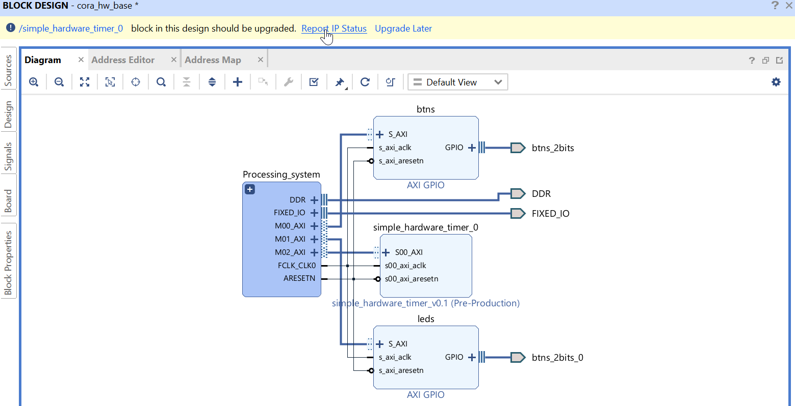
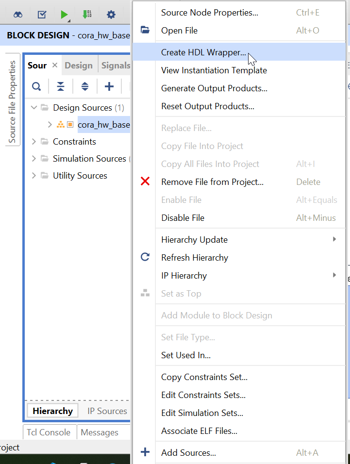

---
title: "Cora Z7-10 HDL project"
author: [Dmitrii Matafonov]
date: 
subtitle: "Detailed guide on Vivado project creation"
keywords: [FPGA, Xilinx, vhdl, documentation]
titlepage: true
titlepage-text-color: "000000"
titlepage-rule-color: "CCCCCC"
titlepage-rule-height: 4
logo: ../assets/soc_icon.png
logo-width: 100 
page-background:
page-background-opacity:
titlepage-background: ../assets/title_page.png
links-as-notes: true
lot: false
lof: false
listings-disable-line-numbers: false
listings-no-page-break: false
disable-header-and-footer: false
header-left:
header-center:
header-right:
footer-left: "Dmitrii Matafonov (@DmitryAndSoCs)"
footer-center:
footer-right:
subparagraph: true
lang: en-US
...

# Introduction

This document is intended to give the reaeder a quick, but detailed guide on how to create a vivado project specifically for Cora Z7-10 developement board (but generally for any base).

This guide is rich for screenshots and remarks for what one may want to cosider during custom project developement. 

## Tools for this guide

One would need [Vivado 2021.2](https://www.xilinx.com/support/download/index.html/content/xilinx/en/downloadNav/vivado-design-tools/archive.html) with USB cable drivers installed. 

This guide is not specific to the PC's operating system.

# Project creation guide

In order to streamline the process of making oneself familiar with the toold, the guide will give MOSTLY step-by-step instructions. But it doesn't mean that it provides detailed actions for literally each button click. Most probably, if something is missing, it is intended that it is very easy and intuitive to guess or part of the base knowledge of working with IDEs such as this one. Also, it is implied that the reader of this document is generally aware of the regular FPGA design flow and their basic principles.

## Cora Z7, new project

After opening Vivado click on the "New project" botton to call the sreen that welcomes us in this endeavour. 


Let's name the project `cora_hw_base` and specify a location. The screenshots contain the locations of this repository. If one creates a from-scratch project, maybe they'd want to specify another location and/or name. 


After clicking next, let's choose these options since we have no pre-made sources.


Clicking `Next` will guide to the part choosing screen. 

> If one is creating a custom solution and has only one SoC in mind, but no board, I'd reccomend going through the process of creating a basic project BEFORE designing a schematic and layout. Creating a basic project with at least pins assigned will eliminate a lot of failure points in the schematic design in the future. 

In the scope of this guide, everything is made simplier with the predefined board support packages. They contain presets with correct constants, project settings and pins. We will briefly touch what could be different when creating custom board.

So, switching to `Boards` tab provides an option to choose a preset for a specific board. The full list may not be available bby default, clicking `Refresh` is necessary. 


Click on the download button in `Status` column in order to download the support package. After downloading, choose `Cora Z7-10` (or another one that fits one's needs) and click next.

After that the project creation is over and clicking `Finish` will switch the layout to the default Vivado layout.

## Creating the project
### Creating base design
>_**Note**: the following step regarding preferred language will affect the guide until the end. I'm going to use VHDL as a matter of preference, but the reader is free to skip the following change and stick to Verilog_


Click on `Settings`on the left sidebar (Flow manager) and choose `VHDL` in the first screen you see. Click OK afterwards. This setting afftects which language is used for Vivado-generated templates and auto-generated code.


It is a matter of preference and one could use Vivado in text-only design mode, I would suggest sticking to the block design flow. It gives the ease of perception and ability to quickly change or add modules to the project. This guide uses block-design flow and does not cover the text-only design input. 

Click `Create block design` on the left sidebar.


After that on the blank page hit `+` sign to add:
- Processing system
- Processing system reset
- AXI interconnect
- 2 AXI GPIO blocks

> Do not connect anything yet

Configue an AXI GPIO block to work with LEDs:
1. Rename one to `leds` (Block properties window left to the block design)
2. Double click on it to edit the properties and choose Board interface `rgb_leds`

> It connects the pins automatically to the correct locations thanks to the predefined board preferences. In case you have a custom board, you'll need to cover the connections in an *.xdc constraints file with correct assignments. I will briefly touch this part further in the document. 

> In this design it is necessary to change the settings later, because by default it assigns bidir IO to LED pins, but at this stage the automation would be helpful. 


Configure the other AXI GPIO block to work with buttons:

1. Name the block to `btns` 
2. Configure to use buttons interface in a similar fashion.

You can make the changes manually for the GPIOs which are self-explainatory.


After that, the block design window would greet the user with suggested helpers that would automatically connect the blocks. It quickens the design, but sometimes it may not be optimal and it could be for the best to connect the blocks manually.


Clicking on `Run Block Automation` will apply presets from the board support package and configure the processing system accordingly to the board's real connections.


> _**Note**: Running Automations for custom board will not give you automatic connections of the PS interfaces. You need to specifically set them manually in the Processing System's settings according to your design, like USB, Ethernet PS connections etc. They are self-explainatory._

To check that the settings were properly applied, one can go to one of the most important parts of the Processing system's settings - DDR traces. 


As it can be noted, the settings are already there and were provided by the developers. 

> Custom boards: there is a calculator that can be called i one chooses `User input` in these DDR configuration settings. It would give the user an option to provide signal propagation speeds (can be taken from PCB factory's documentation) and traces' lenghts (from PCB design). The tool would automatically calculate the values and save them there. It is very important to correctly specify these parameters or the user may end up with suboptimal performance for DDR chips.

Clicking on `Run Connection Automation` will result in the blocks being properly connected. Examine the result to ensure the connections are properly made.


After that, the settings for the base blocks are applied and connections are made. The result should be similar to the following.


To make it more clear to the reviewer, let's hide the following service blocks into a subhierarchy called `Processing system`:

1. Processing system
2. Processing system Reset
3. AXI interconnect

 In order to do that, choose multiple blocks with `ctrl` in context menu choose `Create hierarchy`. Name those 3 blocks 


Change the parameters of the LEDs GPIO: they are input-output by default in this design. The board support file helped with pin locations, but for the ease of use we will need them to be "All output" all the time, this would let us use the simple `devmem` command to write directly into bits that trigger LEDs without the need for drivers or interacting with those through sysfs. 

After that we can finish with customizing the Xilinx-provided blocks that are going to be the core of our design and transition to Custom IP creation.

### Custom AXI IP creation

Most probably the designers are going to use the SoCs to create custom logic that would provide some specific functionality they need, that is usually not achievable by more commons MCUs. 

In the scope of this flow we are going to create a very simple custom IP with intention to use it in our Linux system later. The approach that this project proposes in general may be useful to developers who need to combine the ease of implementation and linux interrupts for custom FPGA modules. 

In order to create a custom IP block that would be used in our block design later, click on `Tools` menu and `Create and Package New IP`


One the next step choose "Create a new AXI4 peripheral". It would generate a project template with ready-to-use AXI slave registers. Designers can easily connect custom logic to these registers to connect their FPGA functionality to the system's AXI4 bus and access that by simply interacting with those meory-mapped registers.


Let's name the IP block accordingly to the functionality it is going to provide.


After that on the last step choose "Add IP to the user repository". This will let one to choose the newly created IP block in the `+` menu of the block design editor.


The suggestion to automate the connections will appear and using this helper tool the resulting design should be the following.


It is now only a functional template that provides memory-mapped RW registers on the AXI systsem bus. To add functionality we need to edit the contents of the block. 


After that a new temporary project window will appear and let us edit the contents of the custom IP as a regular project in a context that it would eventually be packaged into an IP for block design. 

Use Appendix A and B to find the actual VHDL contents of the suggested modifications to the custom IP block. They are rich for comments, but to make the explanation flow fluid, here's a recap.

The custom IP module is a timer that counts based on the provided `CLK` clock signal. `CLK` is 100MHz by default.

The timer has:
- Short CPU interrupt (1 cycle of incoming `CLK`)
- Long software interrupt (clear-on-read, COR)
- Customizable threshold (default one at the compile time and dynamically changeable through AXI)

 The timer issues 2 types of interrupts: a short 1-cycle interrupt for the processing system and a "long" one for the software that would poll the FPGA fabric in order to wait for the interrupt ("soft" interrupt). User-added customizable parameter provides an option to manually set the deafult (on-boot) timer threshold value. 

 After pasting replacing the code with the contents from Appendixes A and B, let's add customization GUI parameters for the ease of changes in the future. In the "Package IP" choose "Customization Parameters" and add `timer_max_value` parameter that is present in the code (in both files and routed through hierarchy). 

 

 After that, I suggest editing the newly created parameter in this fashion. Limiting the maximum threshold value to 1 seconds (based on 100 MHz `CLK` input) is "just because" and doesn't affect the design drastically. 


Compile the porject to be sure everything is sound. Also, it is intended to have testbench to test the functionality at this stage but I'm going to omit it for now in order to speed up the developement.

Use "Re-Package IP" button on "Review and Package" tab, agree to close the temporary project. 

After that the block design will offer the user to refresh the IP because it has changed. It is noticable that our IP doesn't reflect the added `timer_interrupt` output (other internal changes are not there yet, too). 



Vivado tracks the changes of the IPs in the connected repositories and offers updates if they are needed. It can bee seen in the following IP report. 


After upgrading the IP to the new version, Vivado will suggest generating the output products for the IP. The default option is "Out-of-context per IP" and it would suffice in our case. "Global" is rarely needed because of the modular nature of the SoC designs. Agreeing to generate the output products would result in the generation process put to background. 

Upgrading IP will result in timer_interrupt appearing on the IP block.


In order to be able to use the interrupt later, it needs to be connected to the PS. 

Expand the hierarchy by hitting "+" on the Processing_system block. Enter the PS settings and enable the interrupts as shown on the following figure.


In order to connect one or more interrupts, I suggest adding `Concat` block to the block design. It would let the user connect multiple interrupts from the PL part in the future. Creating concat with the "16" parameter value would let the user have the more predictable values when they would be connecting their peripherals through device tree (not only the custom ones). For some reason (maybe it's fixed in some version) automatically assigned numbers of interrupts vary if the concat block contains only one or 2 pins. 

It is easier to just have 16 inputs all the time in the HDL design, the ones that are not used are tied to logical "0". The resulting IRQ numbers, as they should be put in the device tree later during linux build, are shown on the following figure. 


I suggest moving the `Concat` and `GND` blocks into the "Processing system" hierarchy in order to make the design look neat with service modules hidden. 


> Make sure the clock of the Processing system's `FCLK_CLK0` is set to 100 MHz.

In sources tab hit "+" button to add new sources.


After clicking "next" choose "Create file" and name it "pins".


Click "Ok" and "Finish". 

Edit the contents of this file to have the following:

```tcl
#LEDs: LED0 R,G,B LED1 R,G,B
set_property IOSTANDARD LVCMOS33 [get_ports {rgb_leds_tri_o[0]}]
set_property IOSTANDARD LVCMOS33 [get_ports {rgb_leds_tri_o[1]}]
set_property IOSTANDARD LVCMOS33 [get_ports {rgb_leds_tri_o[2]}]
set_property IOSTANDARD LVCMOS33 [get_ports {rgb_leds_tri_o[3]}]
set_property IOSTANDARD LVCMOS33 [get_ports {rgb_leds_tri_o[4]}]
set_property IOSTANDARD LVCMOS33 [get_ports {rgb_leds_tri_o[5]}]
set_property PACKAGE_PIN N15 [get_ports {rgb_leds_tri_o[0]}]
set_property PACKAGE_PIN G17 [get_ports {rgb_leds_tri_o[1]}]
set_property PACKAGE_PIN L15 [get_ports {rgb_leds_tri_o[2]}]
set_property PACKAGE_PIN M15 [get_ports {rgb_leds_tri_o[3]}]
set_property PACKAGE_PIN L14 [get_ports {rgb_leds_tri_o[4]}]
set_property PACKAGE_PIN G14 [get_ports {rgb_leds_tri_o[5]}]
```

> This is needed because of customization of LEDs GPIO block. Since "Custom" was chosen, the locations for the pins are not provided by the board support backage. This is why manual specification of the pins is needed. This approach is the same for fully custom boards. 


As the last step to finalize the HDL block design developement, in "Sources" tab click on the "Create HDL Wrapper..." in order to make the top-level text description of the blocks used in block design. It is going to be the top file that contains the system design that is auto-updated by Vivado when user makes changes to the block design or its subblocks. I don't recommend turning the auto-update feature off.



At this stage the main part of the design can be considered finished. 

### Adding debug nodes

In order to make the debugging easier, it is very convenient to use ChipScope tool to watch the real signals withing our FPGA design. 

> It is not intended that it is used as the main testing tool, but for the simple projects the testbench creating sometimes can be omitted. I don't encourage not having testbenches before going to this step.

In the Flow navigator click "Run Synthesis". After it finishes, the "Set Up Debug" button will be available.


In this window using "Find Nets to Add..." add the interesing nodes from our custom IP to be avaiable later for the user to see in ChipScope tool (part of Hardware manager in Vivado).

I suggest adding the following nodes.


Increase the amount of memory taken by the ChipScope debugger to 8k in order to fit more samples in one take (more timespan). Those samples are in base clock ticks, i.e. 8k * 10 ns period, that is the amount of time one capture is going to have. 

After finishing setting up the debug nodes, use "ctrl+s" to save the changes. Maybe the Vivado would ask where to store the changes (*.xdc constraints file), I suggest naming the file "debug_nodes" and having all the ChipScope settings stored there. It would locate in "Sources" tab under "Constraints" subfolder, if added. 

Close Synthesized window layout and click "Generate bitstream".

## Exporting the design for petalinux tools to use

Use `File -> Export...` to export the hardware description that would be used by petalinux tools to create linux builds. It is also suitable for Vitis IDE that is useful to quickly create baremetal applications based on created designs. 


Include bitstream in order for petalinux to automatically embedd the *.bit file into the linux build and automatically load it at launch. 

I suggest having an external to the project location to store the *.xsa hardware descriptions. They can be used outside of vivado design flow by the people who don't need to know or have the Vivado design project. 


After that it is safe to close Vivado and navigate to petalinux flow (and instructions manual). 

This guide is subject to change. More remarks may be added.

# Appendix A (simple_hardware_timer_v0.1.vhd)

```vhdl {caption="Contents of the simple_hardware_timer_v0.1.vhd"}
library ieee;
use ieee.std_logic_1164.all;
use ieee.numeric_std.all;

entity simple_hardware_timer_v0_1 is
	generic (
		-- Users to add parameters here
        timer_max_value : integer := 49999999; -- in CLK cycles, '0' counts, with 100 MHz: 10 ns * 49999999+1 = 500 ms
		-- User parameters ends
		-- Do not modify the parameters beyond this line


		-- Parameters of Axi Slave Bus Interface S00_AXI
		C_S00_AXI_DATA_WIDTH	: integer	:= 32;
		C_S00_AXI_ADDR_WIDTH	: integer	:= 4
	);
	port (
		-- Users to add ports here
        timer_interrupt : out std_logic; -- timer event interrupt
		-- User ports ends
		-- Do not modify the ports beyond this line


		-- Ports of Axi Slave Bus Interface S00_AXI
		s00_axi_aclk	: in std_logic;
		s00_axi_aresetn	: in std_logic;
		s00_axi_awaddr	: in std_logic_vector(C_S00_AXI_ADDR_WIDTH-1 downto 0);
		s00_axi_awprot	: in std_logic_vector(2 downto 0);
		s00_axi_awvalid	: in std_logic;
		s00_axi_awready	: out std_logic;
		s00_axi_wdata	: in std_logic_vector(C_S00_AXI_DATA_WIDTH-1 downto 0);
		s00_axi_wstrb	: in std_logic_vector((C_S00_AXI_DATA_WIDTH/8)-1 downto 0);
		s00_axi_wvalid	: in std_logic;
		s00_axi_wready	: out std_logic;
		s00_axi_bresp	: out std_logic_vector(1 downto 0);
		s00_axi_bvalid	: out std_logic;
		s00_axi_bready	: in std_logic;
		s00_axi_araddr	: in std_logic_vector(C_S00_AXI_ADDR_WIDTH-1 downto 0);
		s00_axi_arprot	: in std_logic_vector(2 downto 0);
		s00_axi_arvalid	: in std_logic;
		s00_axi_arready	: out std_logic;
		s00_axi_rdata	: out std_logic_vector(C_S00_AXI_DATA_WIDTH-1 downto 0);
		s00_axi_rresp	: out std_logic_vector(1 downto 0);
		s00_axi_rvalid	: out std_logic;
		s00_axi_rready	: in std_logic
	);
end simple_hardware_timer_v0_1;

architecture arch_imp of simple_hardware_timer_v0_1 is

	-- component declaration
	component simple_hardware_timer_v0_1_S00_AXI is
		generic (
		timer_max_value : integer := 49999999;
		C_S_AXI_DATA_WIDTH	: integer	:= 32;
		C_S_AXI_ADDR_WIDTH	: integer	:= 4
		);
		port (
		timer_interrupt : out std_logic; -- timer event interrupt from the lower hierarchy
		S_AXI_ACLK	: in std_logic;
		S_AXI_ARESETN	: in std_logic;
		S_AXI_AWADDR	: in std_logic_vector(C_S_AXI_ADDR_WIDTH-1 downto 0);
		S_AXI_AWPROT	: in std_logic_vector(2 downto 0);
		S_AXI_AWVALID	: in std_logic;
		S_AXI_AWREADY	: out std_logic;
		S_AXI_WDATA	: in std_logic_vector(C_S_AXI_DATA_WIDTH-1 downto 0);
		S_AXI_WSTRB	: in std_logic_vector((C_S_AXI_DATA_WIDTH/8)-1 downto 0);
		S_AXI_WVALID	: in std_logic;
		S_AXI_WREADY	: out std_logic;
		S_AXI_BRESP	: out std_logic_vector(1 downto 0);
		S_AXI_BVALID	: out std_logic;
		S_AXI_BREADY	: in std_logic;
		S_AXI_ARADDR	: in std_logic_vector(C_S_AXI_ADDR_WIDTH-1 downto 0);
		S_AXI_ARPROT	: in std_logic_vector(2 downto 0);
		S_AXI_ARVALID	: in std_logic;
		S_AXI_ARREADY	: out std_logic;
		S_AXI_RDATA	: out std_logic_vector(C_S_AXI_DATA_WIDTH-1 downto 0);
		S_AXI_RRESP	: out std_logic_vector(1 downto 0);
		S_AXI_RVALID	: out std_logic;
		S_AXI_RREADY	: in std_logic
		);
	end component simple_hardware_timer_v0_1_S00_AXI;

begin

-- Instantiation of Axi Bus Interface S00_AXI
simple_hardware_timer_v0_1_S00_AXI_inst : simple_hardware_timer_v0_1_S00_AXI
	generic map (
	    timer_max_value => timer_max_value, -- pass the parameter to the lower hierarchy
		C_S_AXI_DATA_WIDTH	=> C_S00_AXI_DATA_WIDTH,
		C_S_AXI_ADDR_WIDTH	=> C_S00_AXI_ADDR_WIDTH
	)
	port map (
	    timer_interrupt => timer_interrupt, -- pass the interrupt signal from the lower hierarchy
		S_AXI_ACLK	=> s00_axi_aclk,
		S_AXI_ARESETN	=> s00_axi_aresetn,
		S_AXI_AWADDR	=> s00_axi_awaddr,
		S_AXI_AWPROT	=> s00_axi_awprot,
		S_AXI_AWVALID	=> s00_axi_awvalid,
		S_AXI_AWREADY	=> s00_axi_awready,
		S_AXI_WDATA	=> s00_axi_wdata,
		S_AXI_WSTRB	=> s00_axi_wstrb,
		S_AXI_WVALID	=> s00_axi_wvalid,
		S_AXI_WREADY	=> s00_axi_wready,
		S_AXI_BRESP	=> s00_axi_bresp,
		S_AXI_BVALID	=> s00_axi_bvalid,
		S_AXI_BREADY	=> s00_axi_bready,
		S_AXI_ARADDR	=> s00_axi_araddr,
		S_AXI_ARPROT	=> s00_axi_arprot,
		S_AXI_ARVALID	=> s00_axi_arvalid,
		S_AXI_ARREADY	=> s00_axi_arready,
		S_AXI_RDATA	=> s00_axi_rdata,
		S_AXI_RRESP	=> s00_axi_rresp,
		S_AXI_RVALID	=> s00_axi_rvalid,
		S_AXI_RREADY	=> s00_axi_rready
	);

	-- Add user logic here

	-- User logic ends

end arch_imp;

```

# Appendix B (simple_hardware_timer_v0.1_S00_AXI.vhd)

```vhdl {caption="Contents of the simple_hardware_timer_v0.1_S00_AXI.vhd"}
library ieee;
use ieee.std_logic_1164.all;
use ieee.numeric_std.all;
use ieee.std_logic_unsigned.all; -- it is NOT recommended to use unsigned with numeric_std, but for this simple example we can do that safely

entity simple_hardware_timer_v0_1_S00_AXI is
	generic (
		-- Users to add parameters here
        timer_max_value : integer := 49999999; -- in CLK cycles, '0' counts, with 100 MHz: 10 ns * 499999999+1 = 500 ms
		-- User parameters ends
		-- Do not modify the parameters beyond this line

		-- Width of S_AXI data bus
		C_S_AXI_DATA_WIDTH	: integer	:= 32;
		-- Width of S_AXI address bus
		C_S_AXI_ADDR_WIDTH	: integer	:= 4
	);
	port (
		-- Users to add ports here
        timer_interrupt : out std_logic; -- timer event interrupt
		-- User ports ends
		-- Do not modify the ports beyond this line

		-- Global Clock Signal
		S_AXI_ACLK	: in std_logic;
		-- Global Reset Signal. This Signal is Active LOW
		S_AXI_ARESETN	: in std_logic;
		-- Write address (issued by master, acceped by Slave)
		S_AXI_AWADDR	: in std_logic_vector(C_S_AXI_ADDR_WIDTH-1 downto 0);
		-- Write channel Protection type. This signal indicates the
    		-- privilege and security level of the transaction, and whether
    		-- the transaction is a data access or an instruction access.
		S_AXI_AWPROT	: in std_logic_vector(2 downto 0);
		-- Write address valid. This signal indicates that the master signaling
    		-- valid write address and control information.
		S_AXI_AWVALID	: in std_logic;
		-- Write address ready. This signal indicates that the slave is ready
    		-- to accept an address and associated control signals.
		S_AXI_AWREADY	: out std_logic;
		-- Write data (issued by master, acceped by Slave) 
		S_AXI_WDATA	: in std_logic_vector(C_S_AXI_DATA_WIDTH-1 downto 0);
		-- Write strobes. This signal indicates which byte lanes hold
    		-- valid data. There is one write strobe bit for each eight
    		-- bits of the write data bus.    
		S_AXI_WSTRB	: in std_logic_vector((C_S_AXI_DATA_WIDTH/8)-1 downto 0);
		-- Write valid. This signal indicates that valid write
    		-- data and strobes are available.
		S_AXI_WVALID	: in std_logic;
		-- Write ready. This signal indicates that the slave
    		-- can accept the write data.
		S_AXI_WREADY	: out std_logic;
		-- Write response. This signal indicates the status
    		-- of the write transaction.
		S_AXI_BRESP	: out std_logic_vector(1 downto 0);
		-- Write response valid. This signal indicates that the channel
    		-- is signaling a valid write response.
		S_AXI_BVALID	: out std_logic;
		-- Response ready. This signal indicates that the master
    		-- can accept a write response.
		S_AXI_BREADY	: in std_logic;
		-- Read address (issued by master, acceped by Slave)
		S_AXI_ARADDR	: in std_logic_vector(C_S_AXI_ADDR_WIDTH-1 downto 0);
		-- Protection type. This signal indicates the privilege
    		-- and security level of the transaction, and whether the
    		-- transaction is a data access or an instruction access.
		S_AXI_ARPROT	: in std_logic_vector(2 downto 0);
		-- Read address valid. This signal indicates that the channel
    		-- is signaling valid read address and control information.
		S_AXI_ARVALID	: in std_logic;
		-- Read address ready. This signal indicates that the slave is
    		-- ready to accept an address and associated control signals.
		S_AXI_ARREADY	: out std_logic;
		-- Read data (issued by slave)
		S_AXI_RDATA	: out std_logic_vector(C_S_AXI_DATA_WIDTH-1 downto 0);
		-- Read response. This signal indicates the status of the
    		-- read transfer.
		S_AXI_RRESP	: out std_logic_vector(1 downto 0);
		-- Read valid. This signal indicates that the channel is
    		-- signaling the required read data.
		S_AXI_RVALID	: out std_logic;
		-- Read ready. This signal indicates that the master can
    		-- accept the read data and response information.
		S_AXI_RREADY	: in std_logic
	);
end simple_hardware_timer_v0_1_S00_AXI;

architecture arch_imp of simple_hardware_timer_v0_1_S00_AXI is

	-- AXI4LITE signals
	signal axi_awaddr	: std_logic_vector(C_S_AXI_ADDR_WIDTH-1 downto 0);
	signal axi_awready	: std_logic;
	signal axi_wready	: std_logic;
	signal axi_bresp	: std_logic_vector(1 downto 0);
	signal axi_bvalid	: std_logic;
	signal axi_araddr	: std_logic_vector(C_S_AXI_ADDR_WIDTH-1 downto 0);
	signal axi_arready	: std_logic;
	signal axi_rdata	: std_logic_vector(C_S_AXI_DATA_WIDTH-1 downto 0);
	signal axi_rresp	: std_logic_vector(1 downto 0);
	signal axi_rvalid	: std_logic;

	-- Example-specific design signals
	-- local parameter for addressing 32 bit / 64 bit C_S_AXI_DATA_WIDTH
	-- ADDR_LSB is used for addressing 32/64 bit registers/memories
	-- ADDR_LSB = 2 for 32 bits (n downto 2)
	-- ADDR_LSB = 3 for 64 bits (n downto 3)
	constant ADDR_LSB  : integer := (C_S_AXI_DATA_WIDTH/32)+ 1;
	constant OPT_MEM_ADDR_BITS : integer := 1;
	------------------------------------------------
	---- Signals for user logic register space example
	--------------------------------------------------
	---- Number of Slave Registers 4
	signal slv_reg0	:std_logic_vector(C_S_AXI_DATA_WIDTH-1 downto 0);
	signal slv_reg1	:std_logic_vector(C_S_AXI_DATA_WIDTH-1 downto 0);
	signal slv_reg2	:std_logic_vector(C_S_AXI_DATA_WIDTH-1 downto 0);
	signal slv_reg3	:std_logic_vector(C_S_AXI_DATA_WIDTH-1 downto 0);
	signal slv_reg_rden	: std_logic;
	signal slv_reg_wren	: std_logic;
	signal reg_data_out	:std_logic_vector(C_S_AXI_DATA_WIDTH-1 downto 0);
	signal byte_index	: integer;
	signal aw_en	: std_logic;
	
	-- User signals
	signal timer_cnt : std_logic_vector(C_S_AXI_DATA_WIDTH-1 downto 0); -- the same range as the AXI bus
	signal timer_max_count : std_logic_vector(C_S_AXI_DATA_WIDTH-1 downto 0); -- storage for max value that could be overwritten from AXI
	signal timer_interrupt_sw : std_logic; -- "long" interrupt for the software to be able to use polling
	

begin
	-- I/O Connections assignments

	S_AXI_AWREADY	<= axi_awready;
	S_AXI_WREADY	<= axi_wready;
	S_AXI_BRESP	<= axi_bresp;
	S_AXI_BVALID	<= axi_bvalid;
	S_AXI_ARREADY	<= axi_arready;
	S_AXI_RDATA	<= axi_rdata;
	S_AXI_RRESP	<= axi_rresp;
	S_AXI_RVALID	<= axi_rvalid;
	-- Implement axi_awready generation
	-- axi_awready is asserted for one S_AXI_ACLK clock cycle when both
	-- S_AXI_AWVALID and S_AXI_WVALID are asserted. axi_awready is
	-- de-asserted when reset is low.

	process (S_AXI_ACLK)
	begin
	  if rising_edge(S_AXI_ACLK) then 
	    if S_AXI_ARESETN = '0' then
	      axi_awready <= '0';
	      aw_en <= '1';
	    else
	      if (axi_awready = '0' and S_AXI_AWVALID = '1' and S_AXI_WVALID = '1' and aw_en = '1') then
	        -- slave is ready to accept write address when
	        -- there is a valid write address and write data
	        -- on the write address and data bus. This design 
	        -- expects no outstanding transactions. 
	           axi_awready <= '1';
	           aw_en <= '0';
	        elsif (S_AXI_BREADY = '1' and axi_bvalid = '1') then
	           aw_en <= '1';
	           axi_awready <= '0';
	      else
	        axi_awready <= '0';
	      end if;
	    end if;
	  end if;
	end process;

	-- Implement axi_awaddr latching
	-- This process is used to latch the address when both 
	-- S_AXI_AWVALID and S_AXI_WVALID are valid. 

	process (S_AXI_ACLK)
	begin
	  if rising_edge(S_AXI_ACLK) then 
	    if S_AXI_ARESETN = '0' then
	      axi_awaddr <= (others => '0');
	    else
	      if (axi_awready = '0' and S_AXI_AWVALID = '1' and S_AXI_WVALID = '1' and aw_en = '1') then
	        -- Write Address latching
	        axi_awaddr <= S_AXI_AWADDR;
	      end if;
	    end if;
	  end if;                   
	end process; 

	-- Implement axi_wready generation
	-- axi_wready is asserted for one S_AXI_ACLK clock cycle when both
	-- S_AXI_AWVALID and S_AXI_WVALID are asserted. axi_wready is 
	-- de-asserted when reset is low. 

	process (S_AXI_ACLK)
	begin
	  if rising_edge(S_AXI_ACLK) then 
	    if S_AXI_ARESETN = '0' then
	      axi_wready <= '0';
	    else
	      if (axi_wready = '0' and S_AXI_WVALID = '1' and S_AXI_AWVALID = '1' and aw_en = '1') then
	          -- slave is ready to accept write data when 
	          -- there is a valid write address and write data
	          -- on the write address and data bus. This design 
	          -- expects no outstanding transactions.           
	          axi_wready <= '1';
	      else
	        axi_wready <= '0';
	      end if;
	    end if;
	  end if;
	end process; 

	-- Implement memory mapped register select and write logic generation
	-- The write data is accepted and written to memory mapped registers when
	-- axi_awready, S_AXI_WVALID, axi_wready and S_AXI_WVALID are asserted. Write strobes are used to
	-- select byte enables of slave registers while writing.
	-- These registers are cleared when reset (active low) is applied.
	-- Slave register write enable is asserted when valid address and data are available
	-- and the slave is ready to accept the write address and write data.
	slv_reg_wren <= axi_wready and S_AXI_WVALID and axi_awready and S_AXI_AWVALID ;

	process (S_AXI_ACLK)
	variable loc_addr :std_logic_vector(OPT_MEM_ADDR_BITS downto 0); 
	begin
	  if rising_edge(S_AXI_ACLK) then 
	    if S_AXI_ARESETN = '0' then
	      timer_max_count <= std_logic_vector(to_unsigned(timer_max_value, C_S_AXI_DATA_WIDTH)); -- boot with the default value for the timer in place
	      slv_reg1 <= (others => '0');
	      slv_reg2 <= (others => '0');
	      slv_reg3 <= (others => '0');
	    else
	      loc_addr := axi_awaddr(ADDR_LSB + OPT_MEM_ADDR_BITS downto ADDR_LSB);
	      if (slv_reg_wren = '1') then
	        case loc_addr is
	          when b"00" =>
	            for byte_index in 0 to (C_S_AXI_DATA_WIDTH/8-1) loop
	              if ( S_AXI_WSTRB(byte_index) = '1' ) then
	                -- Respective byte enables are asserted as per write strobes                   
	                -- slave registor 0
	                timer_max_count(byte_index*8+7 downto byte_index*8) <= S_AXI_WDATA(byte_index*8+7 downto byte_index*8);
	              end if;
	            end loop;
	          when b"01" =>
	            for byte_index in 0 to (C_S_AXI_DATA_WIDTH/8-1) loop
	              if ( S_AXI_WSTRB(byte_index) = '1' ) then
	                -- Respective byte enables are asserted as per write strobes                   
	                -- slave registor 1
	                slv_reg1(byte_index*8+7 downto byte_index*8) <= S_AXI_WDATA(byte_index*8+7 downto byte_index*8);
	              end if;
	            end loop;
	          when b"10" =>
	            for byte_index in 0 to (C_S_AXI_DATA_WIDTH/8-1) loop
	              if ( S_AXI_WSTRB(byte_index) = '1' ) then
	                -- Respective byte enables are asserted as per write strobes                   
	                -- slave registor 2
	                slv_reg2(byte_index*8+7 downto byte_index*8) <= S_AXI_WDATA(byte_index*8+7 downto byte_index*8);
	              end if;
	            end loop;
	          when b"11" =>
	            for byte_index in 0 to (C_S_AXI_DATA_WIDTH/8-1) loop
	              if ( S_AXI_WSTRB(byte_index) = '1' ) then
	                -- Respective byte enables are asserted as per write strobes                   
	                -- slave registor 3
	                slv_reg3(byte_index*8+7 downto byte_index*8) <= S_AXI_WDATA(byte_index*8+7 downto byte_index*8);
	              end if;
	            end loop;
	          when others =>
	            slv_reg0 <= slv_reg0;
	            slv_reg1 <= slv_reg1;
	            slv_reg2 <= slv_reg2;
	            slv_reg3 <= slv_reg3;
	        end case;
	      end if;
	    end if;
	  end if;                   
	end process; 

	-- Implement write response logic generation
	-- The write response and response valid signals are asserted by the slave 
	-- when axi_wready, S_AXI_WVALID, axi_wready and S_AXI_WVALID are asserted.  
	-- This marks the acceptance of address and indicates the status of 
	-- write transaction.

	process (S_AXI_ACLK)
	begin
	  if rising_edge(S_AXI_ACLK) then 
	    if S_AXI_ARESETN = '0' then
	      axi_bvalid  <= '0';
	      axi_bresp   <= "00"; --need to work more on the responses
	    else
	      if (axi_awready = '1' and S_AXI_AWVALID = '1' and axi_wready = '1' and S_AXI_WVALID = '1' and axi_bvalid = '0'  ) then
	        axi_bvalid <= '1';
	        axi_bresp  <= "00"; 
	      elsif (S_AXI_BREADY = '1' and axi_bvalid = '1') then   --check if bready is asserted while bvalid is high)
	        axi_bvalid <= '0';                                 -- (there is a possibility that bready is always asserted high)
	      end if;
	    end if;
	  end if;                   
	end process; 

	-- Implement axi_arready generation
	-- axi_arready is asserted for one S_AXI_ACLK clock cycle when
	-- S_AXI_ARVALID is asserted. axi_awready is 
	-- de-asserted when reset (active low) is asserted. 
	-- The read address is also latched when S_AXI_ARVALID is 
	-- asserted. axi_araddr is reset to zero on reset assertion.

	process (S_AXI_ACLK)
	begin
	  if rising_edge(S_AXI_ACLK) then 
	    if S_AXI_ARESETN = '0' then
	      axi_arready <= '0';
	      axi_araddr  <= (others => '1');
	    else
	      if (axi_arready = '0' and S_AXI_ARVALID = '1') then
	        -- indicates that the slave has acceped the valid read address
	        axi_arready <= '1';
	        -- Read Address latching 
	        axi_araddr  <= S_AXI_ARADDR;           
	      else
	        axi_arready <= '0';
	      end if;
	    end if;
	  end if;                   
	end process; 

	-- Implement axi_arvalid generation
	-- axi_rvalid is asserted for one S_AXI_ACLK clock cycle when both 
	-- S_AXI_ARVALID and axi_arready are asserted. The slave registers 
	-- data are available on the axi_rdata bus at this instance. The 
	-- assertion of axi_rvalid marks the validity of read data on the 
	-- bus and axi_rresp indicates the status of read transaction.axi_rvalid 
	-- is deasserted on reset (active low). axi_rresp and axi_rdata are 
	-- cleared to zero on reset (active low).  
	process (S_AXI_ACLK)
	begin
	  if rising_edge(S_AXI_ACLK) then
	    if S_AXI_ARESETN = '0' then
	      axi_rvalid <= '0';
	      axi_rresp  <= "00";
	    else
	      if (axi_arready = '1' and S_AXI_ARVALID = '1' and axi_rvalid = '0') then
	        -- Valid read data is available at the read data bus
	        axi_rvalid <= '1';
	        axi_rresp  <= "00"; -- 'OKAY' response
	      elsif (axi_rvalid = '1' and S_AXI_RREADY = '1') then
	        -- Read data is accepted by the master
	        axi_rvalid <= '0';
	      end if;            
	    end if;
	  end if;
	end process;

	-- Implement memory mapped register select and read logic generation
	-- Slave register read enable is asserted when valid address is available
	-- and the slave is ready to accept the read address.
	slv_reg_rden <= axi_arready and S_AXI_ARVALID and (not axi_rvalid) ;

	process (slv_reg0, slv_reg1, slv_reg2, slv_reg3, axi_araddr, S_AXI_ARESETN, slv_reg_rden)
	variable loc_addr :std_logic_vector(OPT_MEM_ADDR_BITS downto 0);
	begin
	    -- Address decoding for reading registers
	    loc_addr := axi_araddr(ADDR_LSB + OPT_MEM_ADDR_BITS downto ADDR_LSB);
	    case loc_addr is
	      when b"00" =>
	        reg_data_out <= timer_max_count; -- let the user read the current timer threshold
	      when b"01" =>
	        reg_data_out(0) <= timer_interrupt_sw; -- let the polling software have the "interrupt_happened" bit
	        reg_data_out(C_S_AXI_DATA_WIDTH-1 downto 1) <= (others => '0'); -- null the other bits
	      when b"10" =>
	        reg_data_out <= slv_reg2; --dummy regs, leftovers from the example
	      when b"11" =>
	        reg_data_out <= slv_reg3;
	      when others =>
	        reg_data_out  <= (others => '0');
	    end case;
	end process; 

	-- Output register or memory read data
	process( S_AXI_ACLK ) is
	begin
	  if (rising_edge (S_AXI_ACLK)) then
	    if ( S_AXI_ARESETN = '0' ) then
	      axi_rdata  <= (others => '0');
	    else
	      if (slv_reg_rden = '1') then
	        -- When there is a valid read address (S_AXI_ARVALID) with 
	        -- acceptance of read address by the slave (axi_arready), 
	        -- output the read dada 
	        -- Read address mux
	          axi_rdata <= reg_data_out;     -- register read data
	      end if;   
	    end if;
	  end if;
	end process;


	-- Add user logic here
    timer_proc:process( S_AXI_ACLK )
    variable loc_addr :std_logic_vector(OPT_MEM_ADDR_BITS downto 0); -- for similar address decoding
    begin
    if rising_edge(S_AXI_ACLK) then
        if S_AXI_ARESETN = '0' then  -- synchronous reset results in a more expected timing behaviour
            timer_cnt <= (others => '0'); -- reset all the bits regardless of vector size
            timer_interrupt_sw <= '0'; -- reset the software interrupt bit
            timer_interrupt <= '0'; -- reset the CPU interrupt bit
        else 
            loc_addr := axi_araddr(ADDR_LSB + OPT_MEM_ADDR_BITS downto ADDR_LSB); -- for similar address decoding
            if timer_cnt >= timer_max_count then    -- in 'if' statements <= and >= are comparisons (less/more or equal), don't mix them!
                timer_cnt <= (others => '0');
                timer_interrupt <= '1'; -- set interrupt for 1 cycle for the CPU
                timer_interrupt_sw <= '1'; -- set the "long" interrupt for polling software
            else 
                timer_interrupt <= '0'; -- interrupt is always '0' when the counter is not at the threshold
                timer_cnt <= timer_cnt + 1;
            end if;
            if ((loc_addr = "00") and (slv_reg_rden = '1')) then -- if the software read the software interrupt bit
                timer_interrupt_sw <= '0';
            end if;
        end if;
    end if;
    end process;
    
	-- User logic ends

end arch_imp;
```